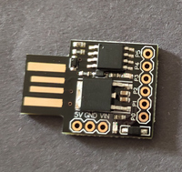
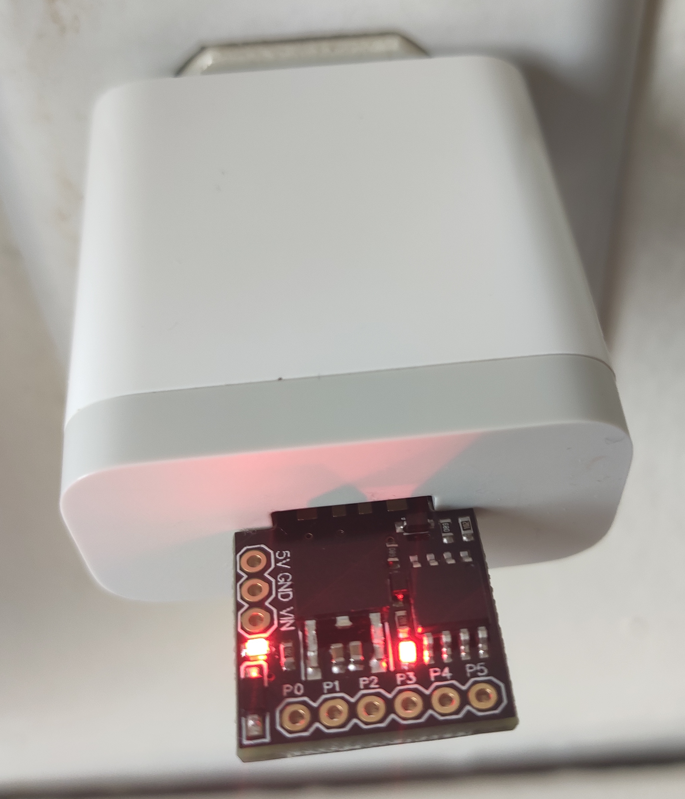

# Skrivena poruka u mikrokontroleru

Ovo je kratko uputstvo za ljude bez iskustva sa mikrokontrolerima kako isprogramirati Digispark ATtiny85 da
paleći LED diodu na pločici prenese proizvoljnu poruku [morzeovom azbukom](https://sr.wikipedia.org/wiki/%D0%9C%D0%BE%D1%80%D0%B7%D0%B5%D0%BE%D0%B2%D0%B0_%D0%B0%D0%B7%D0%B1%D1%83%D0%BA%D0%B0).

## Gde nabaviti Digispark ATtiny85

Sam mikrokontroler ATtiny85 nije skup (oko 100 dinara). Digispark ATtiny85 Development Board
je zapravo ovaj mikrokontroler na pločici na kojoj se pored samog čipa
kontrolera nalaze i dodatne komponente koje omogućavaju napajanje i
programiranje preko USB-a. Možete ga kupiti na [AliExpress](https://www.aliexpress.com/wholesale?SearchText=Digispark+ATtiny85) ili
[eBay](https://www.ebay.com/sch/i.html?_nkw=digispark+attiny85&_sacat=0) za cenu 
koja se kreće od 100-300 dinara u zavisnosti od varijante (postoji puno
kineskih verzija koje su kompatibilne).



## Kako instalirati Arduino IDE

Postoji više načina kako da s programirate ATtiny85, ali najjednostavniji je
instalirati Arduino IDE.

Koraci su sledeći (potreban je Linux, Windows ili Mac računar sa USB portom
u koji se Digispark ATtiny85 može uključiti:

* skinuti nanjnoviju verziju [Arduino IDE](https://www.arduino.cc/en/Main/Software) sa ovog linka
* instalirati je i startovati
* Kliknuti na File -> Preferences i u polje "Additional Board Manager URLs"
uneti: "http://digistump.com/package_digistump_index.json" i kliknuti "OK"
* Otići na Tools -> Board -> Boards Manager...
* Filtrirati Type "Contributed", naći "Digistamp AVR Boards" i kliknuti "Install"
* Ako sve prođe ok pisaće INSTALLED pored - zatvoriti prozor
* U na Tools -> Board izabrati "Digispark (Default - 16.5mhz)"

## Kako isprogramirati mikrokontroler

Da biste isprogramirali kontroler treba da ispratite sledeće korake:
* unesete program u glavni prozor
* kliknete na Sketch -> Verify/Compile
* ako nema grešaka kliknite na Sketch -> Upload
* u narednih 60 sekundi uključite Digispark ATtiny85 u USB port
* ako nema grešaka to je to

## Program za koji pali gasi LED na pločici prenoseći kodiranu poruku

Python skripta [morse.py](morse.py) će proizvoljnu poruku koju definišete u
prvom redu pretvoriti u program koji pali gasi lampicu na pločici kodirajući
tu poruku. Npr:

```
$ python morse.py
```
daće kao izlaz:
```
void setup() {                
    pinMode(1, OUTPUT);
}

void loop() {
    digitalWrite(1, HIGH);delay(5000);digitalWrite(1, LOW);delay(3000);     // Start: on(5s) off(3s)
    digitalWrite(1, HIGH); delay(500); digitalWrite(1, LOW); delay(500);    // morse: .
    digitalWrite(1, HIGH); delay(500); digitalWrite(1, LOW); delay(500);    // morse: .
    digitalWrite(1, HIGH); delay(500); digitalWrite(1, LOW); delay(500);    // morse: .
    digitalWrite(1, HIGH); delay(1000); digitalWrite(1, LOW); delay(500);   // morse: -
    delay(1000);                                                            // morse: delay
    digitalWrite(1, HIGH); delay(1000); digitalWrite(1, LOW); delay(500);   // morse: -
    digitalWrite(1, HIGH); delay(1000); digitalWrite(1, LOW); delay(500);   // morse: -
    digitalWrite(1, HIGH); delay(1000); digitalWrite(1, LOW); delay(500);   // morse: -
    delay(1000);                                                            // morse: delay
    digitalWrite(1, HIGH); delay(500); digitalWrite(1, LOW); delay(500);    // morse: .
    digitalWrite(1, HIGH); delay(1000); digitalWrite(1, LOW); delay(500);   // morse: -
    digitalWrite(1, HIGH); delay(500); digitalWrite(1, LOW); delay(500);    // morse: .
    digitalWrite(1, HIGH); delay(500); digitalWrite(1, LOW); delay(500);    // morse: .
    delay(1000);                                                            // morse: delay
    digitalWrite(1, HIGH); delay(500); digitalWrite(1, LOW); delay(500);    // morse: .
    digitalWrite(1, HIGH); delay(500); digitalWrite(1, LOW); delay(500);    // morse: .
    delay(1000);                                                            // morse: delay
    delay(1000);                                                            // morse: delay
    delay(1000);                                                            // morse: delay
    digitalWrite(1, HIGH); delay(500); digitalWrite(1, LOW); delay(500);    // morse: .
    digitalWrite(1, HIGH); delay(500); digitalWrite(1, LOW); delay(500);    // morse: .
    digitalWrite(1, HIGH); delay(500); digitalWrite(1, LOW); delay(500);    // morse: .
    digitalWrite(1, HIGH); delay(1000); digitalWrite(1, LOW); delay(500);   // morse: -
    delay(1000);                                                            // morse: delay
    digitalWrite(1, HIGH); delay(500); digitalWrite(1, LOW); delay(500);    // morse: .
    digitalWrite(1, HIGH); delay(1000); digitalWrite(1, LOW); delay(500);   // morse: -
    delay(1000);                                                            // morse: delay
    digitalWrite(1, HIGH); delay(500); digitalWrite(1, LOW); delay(500);    // morse: .
    digitalWrite(1, HIGH); delay(500); digitalWrite(1, LOW); delay(500);    // morse: .
    digitalWrite(1, HIGH); delay(500); digitalWrite(1, LOW); delay(500);    // morse: .
    delay(1000);                                                            // morse: delay
    delay(1000);                                                            // morse: delay
    delay(1000);                                                            // morse: delay
    digitalWrite(1, HIGH); delay(1000); digitalWrite(1, LOW); delay(500);   // morse: -
    delay(1000);                                                            // morse: delay
    digitalWrite(1, HIGH); delay(500); digitalWrite(1, LOW); delay(500);    // morse: .
    digitalWrite(1, HIGH); delay(1000); digitalWrite(1, LOW); delay(500);   // morse: -
    delay(1000);                                                            // morse: delay
    digitalWrite(1, HIGH); delay(1000); digitalWrite(1, LOW); delay(500);   // morse: -
    delay(1000);                                                            // morse: delay
    digitalWrite(1, HIGH); delay(500); digitalWrite(1, LOW); delay(500);    // morse: .
    digitalWrite(1, HIGH); delay(1000); digitalWrite(1, LOW); delay(500);   // morse: -
    delay(1000);                                                            // morse: delay
    delay(2000);
}
```
Ovaj program iskopirate u Arduino IDE, kliknete na Sketch -> Verify/Compile, a zatim na Sketch -> Upload i uključite Digispark ATtiny85 u USB port. Posle programiranja krenuće da trepće u ritmu skrivene poruke. Možete ga isključiti. Svaki naredni put kada se uključi tako što dobije napajanje preko USB porta (punjač za telefon, komp) izvršavaće ovaj program.

Ja sam ovo koristio kao mozgalicu za klince. Možda nađete drugačiju upotrebu? Može biti interesantno kao poklon dragoj osobi.

**Napomena**: Gore navedeni postupak ima manu pošto je ovim takozvanim hardkodiranjem poruke program veliki i za duže poruke može prekoračiti dostupnu memoriju, a i potrebno je koristiti python kao među korak. Uradio sam ovao pošto je meni bilo najbrže. [Miroslav Ristić](https://github.com/rikelme) je napravio *C++* verziju programa koji radi isto ali za proizvoljnu poruku. Umesto pythona i kopiranja, iskopirajte sadržaj [main.cpp](main.cpp) direktno u Aduino IDE i flešujte uređaj.



## Šta dalje?

Ovo je samo banalna demonstracija kako se za malo novaca i vremena može isprogramirati ovaj mikrokontroler. On ima 6 pinova koji se mogu koristiti kao ulazi i izlazi. Igrom slučaja na prvi pin je nakačena LED dioda na pločici pa smo to iskoristili, ali lako je moguće na ostale pinove nakačiti bilo šta. Može da pokreće servo, step motore, očitava razne senzore i u zavisnosti od rezultata deluje. 

Ukoliko vam je ovo zanimljivo lako možete doći do resursa na netu za ovaj ili slične čipove / razvojne pločice. Prvi naredni korak može biti da pročitate ovaj tutorijal [http://digistump.com/wiki/oak?redirect=1](http://digistump.com/wiki/oak?redirect=1). Pametne mašine poput onih u Dokovoj kući na početku "Back to the Future" su samo na korak od vas...


 
